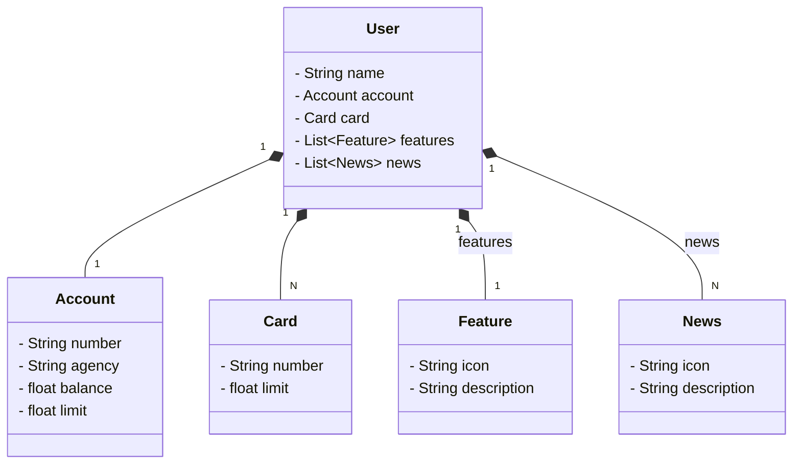

# Santander 2024 - Backend com Java

Java RESTful API criada no bootcamp Santander Backend Java DIO.

## Diagrama de Classes

```mermaid
classDiagram
    class User {
        - String name
        - Account account
        - Card card
        - List~Feature~ features
        - List~News~ news
    }
    
    class Account {
        - String number
        - String agency
        - float balance
        - float limit
    }
    
    class Feature {
        - String icon
        - String description
    }

    class Card {
        - String number
        - float limit
    }

    class News {
        - String icon
        - String description
    }

    User "1" *-- "1" Account
    User "1" *-- "N" Card
    User "1" *-- "1" Feature : features
    User "1" *-- "N" News : news
```
